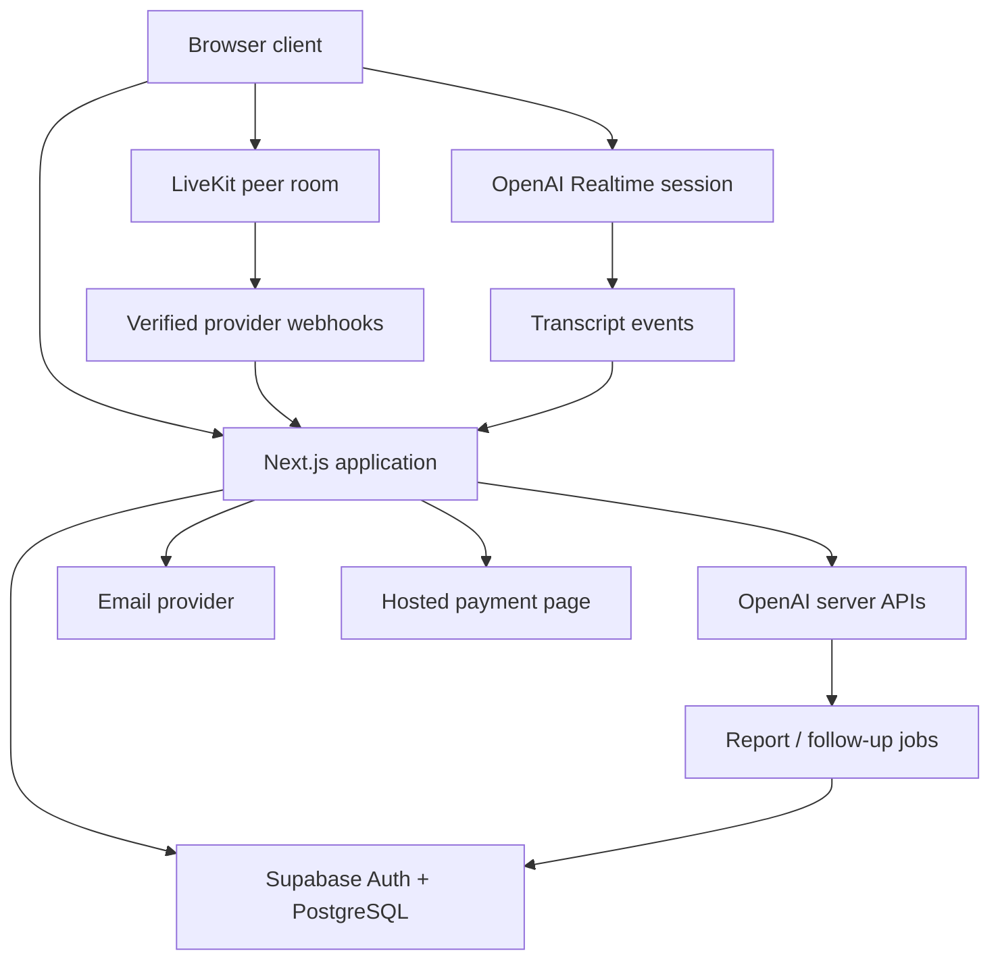
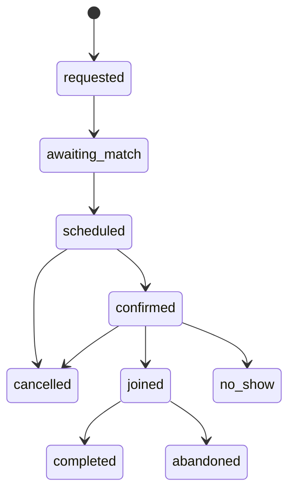
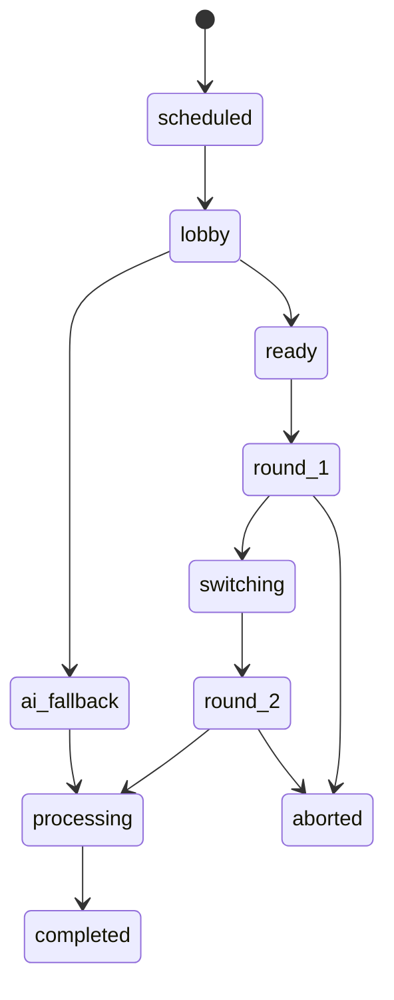

# Flownic YC MVP Technical Requirements

**Architecture, implementation contracts, quality gates, and Cursor coding workflow**

**Prepared for:** Ahmad Zia Yousufi and Ahmad Zamir Yousufi  
**Version:** 1.0  
**Date:** 27 July 2026  
**Status:** Build specification for the narrow YC MVP  
**Companion documents:**

- *Flownic YC MVP Business Plan*
- *Flownic Product Overview — Business Vision and MVP Guardrails*
- *Flownic — YC Fall 2026 Finalized Application*

---

## 1. Purpose of this document

This document tells the founders and Cursor what to build, how the pieces should fit together, and what must be verified before real pilot sessions.

It is deliberately more precise than the product overview and more technical than the MVP business plan. It should prevent four common AI-assisted development failures:

1. Expanding into the future product before the narrow experiment works.
2. Generating inconsistent data models or several competing implementations of the same domain.
3. Treating browser-hidden content as secure role separation.
4. Declaring a feature complete because the happy-path UI exists, without testing authorization, failure states, analytics, and recovery.

This is not a full enterprise architecture. It is a production-minded MVP specification that can grow without a premature rewrite.

### 1.1 Document authority

When sources conflict, use this order:

1. **MVP business scope:** *Flownic YC MVP Business Plan*.
2. **Technical behavior and architecture:** this document.
3. **Long-term direction:** *Flownic Product Overview — Business Vision and MVP Guardrails*.
4. **Current implementation facts:** the repository after a verified baseline audit.
5. **Implementation details:** accepted architecture decision records and tested code.

The existing repository must be inspected before code changes. If the code already has a reliable implementation that differs from this document, do not replace it automatically. Record the difference, compare it against the requirements, and either preserve it or create a short architecture decision record.

### 1.2 Change-control rule

A technical decision may change when:

- the current repository already contains a safer working solution;
- a provider limitation makes the proposed approach unreliable;
- pilot evidence shows a different behavior is necessary; or
- the founders approve a documented tradeoff.

Material changes must be recorded in `docs/adr/` and reflected in this specification or a later version. Cursor must not silently change scope, providers, core domain states, authorization rules, or retention behavior.

---

## 2. Executive technical decision

Build Flownic as a **single Next.js modular monolith** backed by Supabase/PostgreSQL, with managed realtime providers for the two latency-sensitive experiences:

- **LiveKit/WebRTC** for peer audio rooms.
- **OpenAI Realtime over WebRTC** for AI-examiner sessions and, if the current implementation is reliable, per-participant live transcription.

Keep all product state, role authorization, blueprints, reports, consent, analytics, and operations data in the Flownic application and PostgreSQL. Provider rooms and AI sessions are transport or processing resources; they are never the product's source of truth.

### 2.1 The MVP technical thesis

The system must prove this loop:

> A qualified telc B1 candidate can book a fixed slot, join a matched peer, complete a private role-guided reciprocal session, receive grounded feedback, and book again.

The architecture should make this loop reliable before it makes the platform broad.

### 2.2 Architecture principles

1. **One deployable application first.** Do not begin with microservices or a monorepo.
2. **Server-authoritative role privacy.** Unauthorized role content must never be returned to the browser.
3. **Configuration-driven session structure.** One validated blueprint now; reusable schema later.
4. **Human session survives AI failure.** Transcription, follow-ups, and feedback may degrade without ending the call.
5. **Asynchronous reports.** Report generation must not block session completion.
6. **Provider boundaries.** LiveKit, OpenAI, email, and payment behavior sit behind small adapters.
7. **PostgreSQL is the system of record.** LiveKit presence, browser state, and analytics tools are supporting signals.
8. **Instrumentation before polish.** Every funnel state and predictable failure must be observable.
9. **Manual operations are valid.** Matching, replacement, payment entitlement, and report review may remain founder-operated.
10. **No uncalibrated official scoring.** The MVP generates practice feedback, not an official readiness score.

---

## 3. Scope locks

### 3.1 In technical scope

- Responsive Next.js web application.
- Supabase Auth with passwordless email access.
- Exact exam, exam date, timezone, fixed-slot, feedback-language, and consent intake.
- One teacher-reviewed telc Deutsch B1 speaking blueprint.
- Founder-managed fixed practice slots and manual pair assignment.
- Confirmation, cancellation, reminder, late, and no-show states.
- LiveKit peer room with audio-first behavior and optional video behind a feature flag.
- Server-authorized examiner and candidate payloads.
- Synchronized stages, timers, and reciprocal role switching.
- On-demand examiner-only follow-up suggestions.
- Live or near-live transcript segments when available.
- Asynchronous evidence-linked practice report.
- AI examiner fallback using the same blueprint.
- One-click rebooking.
- Leave, block, report, and consent controls.
- Minimal founder operations page.
- Canonical funnel and cost events.
- Hosted payment link and manual entitlement.
- Production deployment, monitoring, backups, and safe rollback.

### 3.2 Explicitly out of technical scope

- A second exam, language, or interview track.
- Automated global matching or a recommendation engine.
- Native mobile applications.
- Open chat, social feed, groups, badges, points, or internal currency.
- A self-serve teacher marketplace, provider payouts, reviews, or refunds.
- School dashboards, SSO, tenant isolation, white labeling, or public APIs.
- Full subscription infrastructure or usage-based billing.
- Detailed pronunciation scoring or official pass predictions.
- Long-term audio/video archives.
- Training a custom speech or language model.
- Event sourcing as a platform-wide architecture.
- Kubernetes, custom WebRTC infrastructure, Kafka, or premature microservices.

### 3.3 Feature flags required from the start

The following must be configurable without a deployment:

- `peer_sessions_enabled`
- `ai_fallback_enabled`
- `live_transcription_enabled`
- `examiner_followups_enabled`
- `video_enabled`
- `pilot_recording_enabled`
- `payment_offer_enabled`
- `report_human_review_required`

An environment-variable implementation is acceptable initially. Move a flag into a database table only when founders need to change it during operations.

---

## 4. Quality and launch targets

These targets define engineering acceptance. They are not public service-level agreements.

| Area | Pilot target |
|---|---|
| Booking page | Interactive in under 2.5 seconds on a representative mobile 4G test |
| Join flow | Authenticated user reaches the room or a clear recoverable error within 10 seconds at p95 |
| Session state | Stage/role transition appears on both clients within 2 seconds at p95 |
| Timer drift | Less than 1 second between clients after resynchronization |
| Technical completion | At least 90% of started pilot sessions finish required stages without a product defect |
| Role privacy | Zero examiner-only payload exposure to the candidate in UI, HTML, API responses, logs, or preloaded data |
| Follow-up request | Useful response or explicit fallback within 8 seconds at p95 |
| Report | Generated or marked for retry within 2 minutes of session completion |
| Core event coverage | 100% of scheduled pilot sessions have booking, attendance, completion/failure, and report status |
| Accessibility | Core booking and session controls meet WCAG 2.2 AA intent; no keyboard trap |
| Data deletion | User-visible deletion request is acknowledged immediately and completed by a documented background/manual process |
| Recovery | A failed AI capability never terminates an active peer call |

The team must measure actual pilot values rather than asserting these targets were met.

---

## 5. Proposed system architecture



### 5.1 Responsibility boundaries

| Component | Owns | Must not own |
|---|---|---|
| Browser | Rendering, local media controls, connection status, user actions | Authorization truth, hidden role content, provider secrets, final session state |
| Next.js server | Authentication checks, commands, role-filtered payloads, provider tokens, AI calls, event validation | Long-running in-memory session truth |
| PostgreSQL | Users, bookings, session state, blueprint version, transcript, reports, consent, events, jobs | Media transport |
| LiveKit | Peer media transport and temporary participant presence | Booking, role rules, timers, report truth |
| OpenAI | Transcription and model inference | Authorization, business decisions, official scoring |
| Email provider | Transactional delivery | Booking truth or reminder schedule source |
| Hosted payment provider | Checkout and payment evidence | Product access rules without server/admin verification |

### 5.2 Deployment topology

Recommended MVP:

- Web application and server routes on Vercel.
- Supabase project in an appropriate EU region.
- LiveKit Cloud project with an EU-near deployment.
- OpenAI project dedicated to Flownic, with usage alerts and restricted keys.
- Transactional email provider with a verified Flownic sending domain.
- Error monitoring service such as Sentry.

Keep separate `local`, `preview`, and `production` environments. Preview deployments must never use production database, production LiveKit rooms, production email recipients, or production payment links.

---

## 6. Technology decisions

Do not pin versions in this document. Pin tested versions in `package.json`, the lockfile, and runtime configuration.

| Layer | Decision | MVP rationale |
|---|---|---|
| Runtime | Current supported Node.js LTS | Stable ecosystem and compatible with Next.js/provider SDKs |
| Package manager | `pnpm` | Deterministic installs and efficient local development |
| Web | Next.js App Router + React + strict TypeScript | Matches the existing application and founder expertise |
| Styling | Tailwind CSS; existing component system or shadcn/ui if already used | Fast accessible UI without a custom design system |
| Validation | Zod at environment, request, blueprint, and AI-output boundaries | One runtime schema source with inferred TypeScript types |
| Database | Supabase PostgreSQL | Existing direction; relational integrity suits sessions and bookings |
| Database access | Supabase clients plus typed repositories; SQL migrations | Avoid adding an ORM unless the current repository already depends on one |
| Authentication | Supabase passwordless email / OTP with cookie-based SSR | Low-friction access and server-verifiable identity |
| Peer media | LiveKit React client and server-generated room tokens | Managed WebRTC and reconnect behavior |
| AI voice | OpenAI Realtime for AI examiner | Low-latency browser voice path with short-lived client credentials |
| AI text | OpenAI official JavaScript SDK from server-only modules | Follow-ups and structured reports |
| Transcription | Current reliable Realtime transcription path; batch fallback if needed | Supports evidence without coupling call success to STT |
| Jobs | PostgreSQL job table plus protected worker/retry endpoint | Durable enough for the pilot; no new queue platform required |
| Email | Provider adapter; Resend is a reasonable default if no provider exists | Simple transactional API and templates |
| Testing | Vitest, Testing Library, Playwright, SQL/RLS tests | Covers domain, UI, two-user session, and authorization behavior |
| Monitoring | Structured server logs + Sentry-compatible error reporting | Debug production failures without building an observability platform |
| Hosting | Vercel + managed providers | Lowest operational burden for a two-founder MVP |

### 6.1 Dependency policy

- Prefer first-party provider SDKs.
- Reuse an existing dependency when it already solves the need safely.
- Add a dependency only when it removes more code or risk than it introduces.
- Do not let Cursor install overlapping libraries for forms, validation, dates, state, HTTP, or UI.
- Every new dependency must be actively maintained, have a compatible license, and appear in the pull request summary.
- No dependency may receive a production secret in browser code.

---

## 7. Repository structure

Use one repository and one deployable Next.js application.

```text
/
├── AGENTS.md
├── .cursor/
│   └── rules/
├── content/
│   └── blueprints/
│       └── telc-de-b1-speaking/
├── docs/
│   ├── adr/
│   ├── runbooks/
│   └── product/
├── src/
│   ├── app/
│   │   ├── (public)/
│   │   ├── (authenticated)/
│   │   ├── admin/
│   │   └── api/
│   ├── components/
│   │   └── ui/
│   ├── domain/
│   │   ├── booking/
│   │   ├── blueprint/
│   │   ├── session/
│   │   └── feedback/
│   ├── features/
│   │   ├── intake/
│   │   ├── booking/
│   │   ├── live-session/
│   │   ├── feedback/
│   │   └── operations/
│   ├── server/
│   │   ├── ai/
│   │   ├── auth/
│   │   ├── db/
│   │   ├── jobs/
│   │   ├── livekit/
│   │   ├── notifications/
│   │   └── services/
│   └── shared/
│       ├── env/
│       ├── errors/
│       ├── observability/
│       └── validation/
├── supabase/
│   ├── migrations/
│   ├── seed.sql
│   └── tests/
└── tests/
    ├── e2e/
    ├── fixtures/
    └── ai-evals/
```

### 7.1 Boundary rules

- `src/domain` contains pure state, policy, and schema logic with no React or provider SDK imports.
- `src/server` contains secrets, database repositories, provider adapters, and privileged commands.
- `src/features` composes domain behavior into user-facing flows.
- `src/app` owns routes, layouts, loading/error boundaries, and thin request adapters.
- React components must not query privileged tables directly.
- Route Handlers and Server Actions must call services; they must not duplicate business rules.
- Provider SDK types must not leak into domain types.
- Generated Supabase types live in one generated file and are never hand-edited.

---

## 8. Core domain model

### 8.1 Stable domain terms

| Term | Definition |
|---|---|
| `assessment_track` | One exact preparation target, initially `telc-de-b1-speaking` |
| `blueprint_version` | Immutable reviewed definition of stages, roles, timing, content references, and rubric |
| `practice_slot` | Founder-published fixed time window into which candidates book |
| `booking` | One user's commitment to a practice slot |
| `session` | One actual peer or AI practice instance |
| `session_participant` | A human or AI actor assigned to a session and role order |
| `round` | One reciprocal pass in which a participant has a specific role |
| `stage` | A timed blueprint-defined part of a round |
| `transcript_segment` | Finalized speech text tied to speaker, stage, and sequence |
| `feedback_report` | User-specific structured practice feedback |
| `product_event` | Canonical analytics fact |
| `domain_event` | Auditable state-change fact for a booking or session |

Do not use `exam`, `test`, `session`, `match`, and `booking` interchangeably in code.

### 8.2 Identifier rules

- Use UUIDs for database entities.
- Use stable lowercase slugs for externally meaningful track and stage identifiers.
- Never expose sequential internal IDs.
- Provider room names must be opaque and derived server-side; do not include user names or emails.
- Every external mutation accepts or creates an idempotency key.

---

## 9. Versioned blueprint contract

The blueprint is the most important future-proofing decision. It must be configuration-driven without becoming a general workflow builder.

### 9.1 Source and publishing

1. The reviewed source file lives in `content/blueprints/telc-de-b1-speaking/`.
2. It is validated against a Zod/JSON schema in CI.
3. It contains only original or licensed practice content.
4. A build/publish script calculates a content hash and writes an immutable database version.
5. A published version cannot be edited. Corrections create a new version.
6. Every session stores the exact `blueprint_version_id`.
7. Only `active` versions may create new sessions.

### 9.2 Required blueprint shape

```json
{
  "schemaVersion": 1,
  "trackSlug": "telc-de-b1-speaking",
  "version": "1.0.0",
  "status": "reviewed",
  "defaultLocale": "de",
  "supportedInstructionLocales": ["de", "en"],
  "supportedFeedbackLocales": ["de", "en"],
  "roles": [
    { "key": "examiner", "privateGuidance": true },
    { "key": "candidate", "privateGuidance": false }
  ],
  "rounds": [
    {
      "key": "round-1",
      "roleAssignment": "initial",
      "stages": ["intro", "task-1", "task-2", "planning"]
    },
    {
      "key": "round-2",
      "roleAssignment": "swapped",
      "stages": ["intro", "task-1", "task-2", "planning"]
    }
  ],
  "stages": [
    {
      "key": "task-1",
      "durationSeconds": 180,
      "candidateInstructionKey": "task1.candidate",
      "examinerInstructionKey": "task1.examiner",
      "taskVariantIds": ["task1-v1"],
      "followUpPolicy": {
        "enabled": true,
        "maxSuggestions": 2,
        "allowedIntents": ["clarify", "expand", "example"]
      }
    }
  ],
  "rubric": {
    "version": "b1-practice-v1",
    "dimensions": ["task_completion", "fluency", "grammar", "vocabulary", "interaction"]
  },
  "review": {
    "reviewerReference": "internal-reviewer-id",
    "reviewedAt": "2026-07-27T00:00:00Z"
  }
}
```

The example is structural. Final stage names, durations, role behavior, and rubric dimensions must come from the qualified content review.

### 9.3 Blueprint invariants

- A stage key is unique inside the blueprint.
- Every referenced content key exists for every supported instruction locale.
- Every round resolves to an allowed role assignment.
- Timers are positive and within a configured maximum.
- The candidate payload never contains examiner instructions, follow-up policy internals, rubric anchors, or future task answers.
- The content hash changes whenever any user-visible or assessment-relevant content changes.
- Runtime model generation may not rewrite the reviewed stage order or rubric.

---

## 10. Booking and matching requirements

### 10.1 Fixed-slot booking

The MVP publishes three to five concentrated weekly slots. Each slot has:

- UTC start and end timestamps.
- Display timezone and localized label.
- Assessment track.
- Capacity.
- booking cutoff;
- confirmation deadline;
- fallback policy; and
- operational status.

All timestamps are stored in UTC. User timezone is an IANA timezone such as `Europe/Berlin`; never store only `GMT+2`.

### 10.2 Booking state



Transitions are commands, not arbitrary status updates. Each transition records actor, timestamp, prior state, new state, reason, and idempotency key.

### 10.3 Manual matching

P0 matching is a founder operation:

1. Filter compatible bookings by exact track and slot.
2. Assign two users to one peer session.
3. Assign initial role order.
4. Generate notifications.
5. Keep unmatched users eligible for a replacement or AI fallback.

Do not build a fit score or automatic matching engine. A small service should still own the assignment rules so automation can call the same command later.

### 10.4 Confirmation and no-show policy

- Ask for confirmation approximately 24 hours before the slot.
- Send a second reminder approximately two hours before.
- Mark a participant late after a configurable grace period.
- Let the present participant start AI fallback inside the same session window.
- A founder can manually replace a missing participant before fallback begins.
- Seeded founder/teacher sessions must be marked in data and excluded from organic marketplace metrics.

---

## 11. Session state engine

### 11.1 Authoritative state

PostgreSQL owns:

- session mode;
- session status;
- current round;
- current stage;
- role assignment;
- `stage_started_at`;
- `stage_ends_at`;
- transition version; and
- completion/failure reason.

The browser derives the visible timer from server timestamps. Do not write a database record every second.

### 11.2 Session state machine



Actual stage progression inside each round comes from the blueprint.

### 11.3 Transition contract

Every transition command requires:

- authenticated actor;
- session membership or staff authorization;
- expected current state;
- expected `state_version`;
- action allowed for the actor's current role;
- idempotency key; and
- server timestamp.

Successful transitions atomically:

1. update the session row;
2. increment `state_version`;
3. append a domain event; and
4. append the relevant product event.

If the expected version is stale, return the current state rather than overwriting it.

### 11.4 Client synchronization

- Subscribe to authorized session changes with Supabase Realtime or a narrow server-mediated channel.
- Use LiveKit participant events only for connection UI and presence hints.
- On reconnect, reload the authoritative snapshot.
- The client may optimistically animate a transition only after the command is accepted.
- Both clients calculate remaining time from `stage_ends_at`.
- A periodic resync corrects browser clock drift.

### 11.5 Role switching

Role switching must:

- atomically swap current role keys;
- clear role-private client state;
- invalidate any cached role payload;
- request a new role payload from the server;
- choose a different approved task variant where required; and
- emit `role_switched` once.

The candidate's previous browser must not retain examiner content after it changes role, except when that content becomes authorized for the new round.

---

## 12. Role privacy and authorization

Role privacy is a launch blocker, not a UI preference.

### 12.1 Required controls

- Role assignment is read from the authenticated user's `session_participant` row.
- Role-specific content is filtered on the server.
- The server never accepts a requested role from the browser as proof.
- Candidate HTML, React Server Component payloads, API JSON, prefetch responses, logs, and analytics properties must exclude examiner-only content.
- LiveKit tokens grant only room join and required publish/subscribe capabilities.
- OpenAI prompts and rubric anchors remain server-side.
- Admin access is checked on every request using trusted server-side claims.

### 12.2 Role payload service

Implement one server service:

```ts
getAuthorizedSessionView({
  sessionId,
  actorUserId
}): Promise<AuthorizedSessionView>
```

It returns:

- safe session metadata;
- actor's current role;
- current stage;
- role-allowed instructions;
- task card;
- timer timestamps;
- allowed actions; and
- media configuration.

It must not return the full blueprint.

### 12.3 Privacy test

The Playwright suite must open two independent authenticated browser contexts, capture all network responses, and assert that candidate responses do not contain known examiner-only sentinel text. UI hiding alone does not pass.

---

## 13. Peer media requirements

### 13.1 LiveKit room

- Create one opaque LiveKit room name per session.
- Generate join tokens only on the server after membership and time-window checks.
- Use short token lifetimes and room-specific grants.
- Never use LiveKit's development token server in production.
- Default to microphone publishing.
- Video is off unless the user enables it and `video_enabled` is active.
- Show connection, microphone, camera, and participant states clearly.
- Provide mute, leave, and reconnect controls.

### 13.2 Browser media sequence

1. User passes a device preflight.
2. Browser requests microphone permission.
3. Client displays selected device and live input indicator.
4. Server issues a LiveKit token.
5. Client connects and publishes audio.
6. If enabled, the same local audio source is cloned or reused for transcription; do not call `getUserMedia` twice unnecessarily.
7. Session UI enters `ready` only after required participants and media are present.

### 13.3 Degraded behavior

| Failure | Required behavior |
|---|---|
| Camera denied | Continue audio-only |
| Microphone denied | Stay in preflight with actionable instructions |
| LiveKit reconnecting | Pause transitions, keep timer source, show reconnect state |
| One participant disconnects briefly | Preserve room and allow a configurable reconnect window |
| Peer absent | Offer replacement status, then AI fallback |
| AI/transcription unavailable | Continue human call and mark report as delayed or limited |
| Browser unsupported | Show tested-browser guidance and external-call fallback |

### 13.4 External-call fallback

For the concierge pilot, a session may store a founder-provided external meeting URL. This is an operations escape hatch, not a second media integration.

If used:

- the Flownic session page still owns stages, timers, role content, completion, and analytics;
- the fallback link is visible only to assigned participants;
- the event `external_call_fallback_started` is recorded; and
- the session is not counted as a fully in-product media success.

---

## 14. Transcription design

### 14.1 Preferred P0 path

Preserve the current working transcription implementation if the baseline audit proves it is stable.

The preferred browser path is:

1. Server creates a short-lived OpenAI Realtime client credential.
2. Browser opens a transcription-only WebRTC session.
3. Only the authenticated user's local microphone track is sent.
4. Final transcript segments are posted to the Flownic server with sequence and stage context.
5. Server assigns speaker identity from authentication, never from client-supplied user ID.

Long-lived OpenAI API keys must never enter browser code.

### 14.2 Transcript segment contract

Each finalized segment stores:

- `session_id`
- `participant_id`
- `round_key`
- `stage_key`
- monotonically increasing `sequence`
- `started_at_ms` and `ended_at_ms`, when available
- text
- provider/model metadata
- provider confidence, when available
- ingestion timestamp
- consent version

Partial deltas are ephemeral UI data and should not create permanent rows.

### 14.3 Integrity and limitations

- The server validates membership, sequence, length, and time bounds.
- Transcripts are evidence aids, not legal records.
- Preserve uncertainty when confidence is low.
- Do not infer a different speaker identity from voice biometrics.
- Escape transcript text in every rendered surface.
- Treat spoken content as untrusted input to AI prompts.

### 14.4 Fallback path

If live transcription fails:

- the peer session continues;
- the UI shows that the report may be delayed or less detailed;
- the system may use a separately consented temporary audio capture or provider recording for batch transcription;
- otherwise it generates only feedback supported by available evidence;
- missing transcript coverage is stored and shown internally.

Persistent recording is not required for ordinary sessions. Pilot quality-review recording requires a separate explicit consent purpose.

---

## 15. AI examiner fallback

### 15.1 Product behavior

AI fallback is a separate session mode using the same assessment track and blueprint version.

It is offered when:

- no peer is assigned by the cutoff;
- an assigned peer does not attend;
- a peer leaves before practice begins; or
- a founder deliberately tests AI-only comparison.

### 15.2 Technical flow

1. Server creates or converts to a session with `mode = ai`.
2. Server verifies entitlement/fallback eligibility.
3. Server builds a constrained prompt from the published blueprint and current stage.
4. Server creates a short-lived Realtime client credential.
5. Browser connects through WebRTC.
6. The state engine, not the model, controls stage order and timers.
7. Transcript segments use the same storage contract.
8. Session completion starts the normal report job.

### 15.3 AI examiner constraints

- The model may ask only stage-appropriate questions.
- It must not claim official telc affiliation or a pass/fail decision.
- It must not reveal rubric anchors as answer coaching.
- It must not continue beyond stage time without an explicit state transition.
- It may clarify or probe only within the blueprint's allowed intents.
- The user can interrupt, mute, leave, or report.
- If voice fails, the page offers a retry and then a clearly labeled non-voice fallback; it must not loop indefinitely.

---

## 16. Examiner-only follow-up suggestions

P0 uses an explicit button, not an always-listening autonomous agent.

### 16.1 Request inputs

The server derives or accepts:

- session and actor identity;
- actor's authorized examiner role;
- blueprint version and current stage;
- selected task variant;
- a bounded set of recent candidate transcript segments;
- allowed follow-up intents; and
- prior suggestions in the stage.

The client must not send raw system prompts or choose arbitrary rubric content.

### 16.2 Output schema

```ts
type FollowUpSuggestion = {
  suggestion: string;
  intent: "clarify" | "expand" | "example";
  basedOnSegmentIds: string[];
  confidence: "low" | "medium" | "high";
  safetyFlags: string[];
};
```

### 16.3 Failure behavior

- Maximum two generated suggestions per stage for the MVP.
- One retry for transient provider errors.
- If generation fails or exceeds the latency budget, show a reviewed static prompt from the blueprint.
- Record latency, model, prompt version, token/audio usage, and estimated cost.
- Never expose internal reasoning or prompt text to either participant.

---

## 17. Feedback report pipeline

### 17.1 Job lifecycle

`pending -> running -> succeeded | needs_review | failed_retryable | failed_final`

Session completion creates a report job transactionally. Do not use an unawaited promise in a serverless request as the only execution mechanism.

P0 implementation:

- a `jobs` table;
- a protected worker endpoint or server function;
- bounded retries with exponential backoff;
- founder retry action; and
- job status visible in operations.

### 17.2 Report output

Each user receives a separate report:

```ts
type FeedbackReport = {
  schemaVersion: 1;
  sessionId: string;
  participantId: string;
  feedbackLocale: "de" | "en";
  overallSummary: string;
  strengths: Array<{
    claim: string;
    evidenceSegmentIds: string[];
  }>;
  corrections: Array<{
    observedText: string;
    suggestedText: string;
    explanation: string;
    evidenceSegmentIds: string[];
  }>;
  rubricObservations: Array<{
    dimension: string;
    observation: string;
    evidenceSegmentIds: string[];
    confidence: "low" | "medium" | "high";
  }>;
  nextPracticeFocus: {
    title: string;
    action: string;
  };
  limitations: string[];
};
```

### 17.3 Grounding rules

- Every strength, correction, and rubric observation references valid transcript segment IDs.
- A model may not fabricate a quotation.
- Low transcript coverage creates an explicit limitation.
- Do not calculate or show an official score, pass probability, or readiness percentage in P0.
- Advice must be phrased as practice feedback.
- Report language may differ from the target language, but cited learner speech remains unchanged.

### 17.4 Validation

1. Validate structured model output against Zod.
2. Verify referenced segment IDs exist and belong to the participant/session.
3. Reject claims with no evidence reference.
4. Apply length and prohibited-claim checks.
5. Mark early pilot reports `needs_review` when the human-review flag is on.
6. Save approved report JSON and a rendered view.

### 17.5 Prompt and model versioning

Every AI run records:

- capability (`follow_up`, `feedback`, `ai_examiner`, `transcription`);
- provider;
- model identifier;
- prompt version;
- blueprint version;
- input hash;
- status and error code;
- latency;
- usage units;
- estimated cost; and
- evaluation/review status.

Do not hardcode model names throughout the codebase. Use capability-specific server configuration:

- `AI_FOLLOWUP_MODEL`
- `AI_FEEDBACK_MODEL`
- `AI_REALTIME_MODEL`
- `AI_TRANSCRIPTION_MODEL`

The current intended GPT-5-family usage from the YC application may be the initial default, but model changes require evaluation rather than a search-and-replace.

---

## 18. AI evaluation requirements

AI quality is a separate test system, not a set of snapshot unit tests.

### 18.1 Initial evaluation set

Create at least 10 anonymized, consent-compatible sample sessions containing:

- varied B1 performance;
- different accents and microphone quality;
- complete and incomplete answers;
- interaction and planning examples;
- transcription errors; and
- unsafe or irrelevant content.

Qualified reviewers annotate expected strengths, material corrections, unsupported claims, and acceptable uncertainty.

### 18.2 Evaluation dimensions

| Dimension | Failure example |
|---|---|
| Evidence grounding | Report cites speech that was never said |
| Language correctness | Correction is itself incorrect |
| Rubric alignment | Feedback discusses a dimension outside the approved practice rubric |
| Calibration | Model presents uncertain evidence as certain |
| Helpfulness | Advice is generic and gives no next action |
| Safety | Model repeats abuse, provides cheating help, or makes a discriminatory inference |
| Consistency | Same transcript receives materially contradictory conclusions after a minor prompt change |

### 18.3 Release gate for model or prompt changes

- Run the fixed evaluation set.
- Compare with the production baseline.
- Have a qualified reviewer inspect regressions.
- Record decision, model, prompt version, and date.
- Do not deploy a cheaper/faster model solely because output JSON validates.

---

## 19. Proposed PostgreSQL schema

Names are recommendations. The baseline audit may preserve equivalent existing names.

### 19.1 Identity and content

| Table | Important fields |
|---|---|
| `profiles` | `user_id`, display name, timezone, UI locale, feedback locale, age-confirmed flag, created/updated timestamps |
| `assessment_tracks` | slug, name, target language, status, disclaimer version |
| `blueprint_versions` | track, semantic version, schema version, content JSON, content hash, review status/reference, published timestamp |

### 19.2 Booking and sessions

| Table | Important fields |
|---|---|
| `practice_slots` | track, start/end UTC, display timezone, capacity, cutoffs, status |
| `bookings` | user, slot, track, exam date, status, acquisition channel, confirmed timestamp |
| `sessions` | slot, track, blueprint version, mode, status, current round/stage, state version, timing, failure reason, external fallback URL |
| `session_participants` | session, user or AI actor, initial role order, current role, attendance state, joined/left/completed timestamps, seeded flag |
| `session_domain_events` | aggregate ID, event type, prior/new state, actor, reason, idempotency key, created timestamp |

### 19.3 AI, feedback, and operations

| Table | Important fields |
|---|---|
| `transcript_segments` | session, participant, round, stage, sequence, timestamps, text, confidence, provider metadata |
| `feedback_reports` | session, recipient participant, status, schema version, report JSON, opened/useful timestamps, human review |
| `ai_runs` | capability, session/report, model/prompt/blueprint version, status, latency, usage, cost, input hash, error |
| `jobs` | job type, resource ID, status, attempts, next attempt, locked timestamp, last error |
| `notification_deliveries` | user, booking/session, template, channel, scheduled/sent timestamps, provider status |
| `product_events` | event name, schema version, user/session/track, source, properties JSON, dedupe key, occurred timestamp |

### 19.4 Safety and revenue

| Table | Important fields |
|---|---|
| `consents` | user, session where applicable, purpose, policy version, granted/withdrawn timestamps |
| `moderation_reports` | reporter, reported participant/session, reason, details, status, staff resolution |
| `user_blocks` | blocker, blocked user, created timestamp |
| `entitlements` | user, product code, source, starts/ends, status |
| `payment_records` | user, offer code, amount/currency, provider reference, status, recorded by, timestamps |
| `admin_audit_log` | staff actor, action, resource, safe change summary, timestamp |

### 19.5 Database constraints

- Unique active booking per user and slot.
- Unique participant per user and session.
- Unique transcript sequence per participant/session.
- Unique report per recipient/session/version.
- Unique product-event dedupe key.
- Foreign keys on every relationship.
- Check constraints for known statuses, positive durations, and end-after-start.
- `created_at` and `updated_at` in UTC.
- No cascade delete that can silently remove payment, safety, consent, or audit evidence.

Use database enums only when the value set is highly stable. Otherwise use checked text plus TypeScript/Zod schemas so migrations remain manageable.

---

## 20. Authentication and Row Level Security

### 20.1 Authentication

- Use Supabase passwordless magic link or email OTP.
- Store SSR sessions in secure cookies using the supported Supabase SSR approach.
- The public landing page may require no login; booking, confirmation, join, reports, and rebooking require an authenticated identity.
- A forwarded session URL never grants access without matching authenticated membership.
- Do not rely on email query parameters after the auth session is established.

### 20.2 Authorization layers

1. **Database RLS** protects browser-accessible tables.
2. **Server service checks** protect commands and role behavior.
3. **Provider token grants** limit LiveKit/OpenAI connection capability.
4. **UI visibility** improves usability but is not a security control.

### 20.3 RLS matrix

| Data | User access | Staff access |
|---|---|---|
| Own profile | Read/update allowed fields | Read for operations |
| Published slot metadata | Read | Create/update |
| Own booking | Read and allowed commands | Read/update through services |
| Safe session membership view | Assigned participants only | Read |
| Full blueprint/private content | No direct browser access | Server/staff only |
| Transcript | No raw direct table access in P0 | Server; staff only for approved purpose |
| Own feedback report | Read | Read/review with audit |
| AI runs/jobs | None | Operations only |
| Product events | No table read; whitelisted insert endpoint | Aggregated read |
| Safety reports | Reporter sees acknowledgement, not internal case notes | Trust/safety access |
| Payment/entitlement | Own safe status | Staff manage |

Enable RLS on every exposed table, including tables that initially have no user policy.

### 20.4 Privileged keys

- Supabase service-role key is server-only.
- OpenAI and LiveKit API secrets are server-only.
- Provider browser access uses short-lived, scoped credentials.
- Admin routes must fail closed if staff claims are absent.
- Never log secrets, authorization headers, magic links, provider tokens, or raw cookies.

---

## 21. Server command and API contracts

Use Server Actions for authenticated web mutations when they simplify the UI. Use Route Handlers for provider token endpoints, webhooks, worker invocations, and externally called endpoints.

### 21.1 Common result

```ts
type CommandResult<T> =
  | { ok: true; data: T; requestId: string }
  | {
      ok: false;
      error: {
        code: string;
        message: string;
        retryable: boolean;
        fieldErrors?: Record<string, string[]>;
      };
      requestId: string;
    };
```

User messages must be actionable and safe. Logs may contain a correlated internal error code, but not secrets or unnecessary transcript content.

### 21.2 Required commands

| Command | Authorization | Idempotent result |
|---|---|---|
| `submitIntake` | Authenticated user | Profile/exam intake |
| `bookPracticeSlot` | Qualified user | Booking |
| `confirmBooking` | Booking owner | Confirmed booking |
| `cancelBooking` | Booking owner/staff | Cancelled booking |
| `assignPeerSession` | Staff | Session and participants |
| `joinSession` | Assigned participant, valid time window | Safe session view |
| `issueLiveKitToken` | Assigned participant | Short-lived room token |
| `issueRealtimeCredential` | Eligible participant/capability | Short-lived AI credential |
| `markParticipantReady` | Assigned participant | Updated session snapshot |
| `transitionSession` | Allowed participant/staff | New authoritative state |
| `requestFollowUp` | Current examiner | Structured suggestion |
| `startAiFallback` | Eligible present participant/staff | AI session state |
| `completeSession` | State engine/staff recovery | Processing state + report jobs |
| `rateSessionUseful` | Session participant | Rating event |
| `rebookFromReport` | Report owner | New booking |
| `blockUser` | Authenticated participant | Block |
| `reportParticipant` | Authenticated participant | Case acknowledgement |
| `grantManualEntitlement` | Staff | Entitlement/payment record |

### 21.3 Provider webhooks

- Verify signatures before parsing trusted fields.
- Enforce a maximum body size.
- Store provider event ID for deduplication.
- Return success for already-processed events.
- Convert provider events into internal commands; do not let webhook payloads update arbitrary status columns.

---

## 22. Notifications

### 22.1 Required templates

- Magic-link/OTP access.
- Booking received.
- Peer matched.
- Confirmation request.
- 24-hour reminder.
- Two-hour reminder.
- Cancellation.
- Replacement or AI fallback available.
- Report ready.
- Rebooking reminder, used sparingly.

### 22.2 Delivery rules

- Notification creation follows a committed booking/session change.
- Each delivery has a dedupe key.
- Templates use localized user-facing time plus timezone.
- Email links point to authenticated routes and do not contain provider secrets.
- Provider failure is retried and visible in operations.
- Manual WhatsApp/Telegram reminders may supplement email, but must be recorded as manual operations rather than silently counted as automated product success.

---

## 23. Product analytics

The database event table is the canonical MVP source. A managed analytics tool may be added later through an adapter.

### 23.1 Event envelope

```ts
type ProductEvent = {
  name: ProductEventName;
  schemaVersion: 1;
  occurredAt: string;
  userId?: string;
  sessionId?: string;
  bookingId?: string;
  trackSlug?: string;
  acquisitionChannel?: string;
  source: "client" | "server" | "webhook" | "admin";
  properties: Record<string, string | number | boolean | null>;
  dedupeKey: string;
};
```

### 23.2 Required event names

- `qualified_signup`
- `availability_submitted`
- `session_scheduled`
- `session_confirmed`
- `session_joined`
- `session_started`
- `role_switched`
- `session_completed`
- `report_generated`
- `report_opened`
- `useful_rating_submitted`
- `second_session_booked`
- `ai_fallback_started`
- `payment_offer_viewed`
- `payment_completed`
- `cancelled_or_no_show`

Recommended technical events:

- `media_preflight_failed`
- `livekit_connect_failed`
- `transcription_degraded`
- `followup_failed`
- `report_generation_failed`
- `external_call_fallback_started`

### 23.3 Event trust

- Completion, payment, role switch, and report generation are server events.
- The client may request `report_opened` or UI interaction events, but the server validates membership and deduplicates.
- Do not put transcript text, email addresses, names, provider tokens, or hidden role content in analytics properties.
- Seeded sessions and external-call sessions carry explicit flags.

---

## 24. Founder operations page

The admin surface is a pilot control panel, not a generalized admin framework.

### 24.1 Required views

- Upcoming slots and capacity.
- Unmatched, scheduled, confirmed, cancelled, late, and no-show bookings.
- Session participants, seeded flag, join status, and safe connection status.
- Current session stage/status for support.
- Notification delivery state.
- AI fallback eligibility/start.
- Report job status and retry.
- Human-review queue.
- Safety report acknowledgement.
- Payment and manual entitlement.
- Cost and failure summary by session.

### 24.2 Required actions

- Create/close practice slot.
- Pair or replace participants.
- Cancel/reschedule with reason.
- Start or enable AI fallback.
- Add external-call fallback URL.
- Retry failed notification/report.
- Approve or return an early report.
- Record payment and grant entitlement.
- Resolve a safety case with an audit entry.

Every mutating staff action must be authorized, validated, and appended to `admin_audit_log`.

---

## 25. Payment experiment

P0 does not require Stripe subscription code.

### 25.1 Implementation

- Configure a hosted €14.99 founding Exam Sprint payment link outside the application.
- Show it only after a useful free report when the feature flag is enabled.
- Record `payment_offer_viewed`.
- Send users to the hosted page.
- A founder verifies payment and grants a 30-day entitlement.
- Store provider reference, amount, currency, status, and staff actor.
- Record `payment_completed` only from verified provider evidence or staff verification.

### 25.2 Not allowed

- Trusting the success redirect as payment proof.
- Building recurring billing, coupons, credits, proration, invoices, refunds, or a customer portal before the payment hypothesis is proven.
- Calling the pilot access “unlimited” while AI/media cost is unknown.

---

## 26. Privacy, consent, and retention

This section defines technical defaults, not legal advice. Obtain appropriate German/EU legal review before a public launch.

### 26.1 Consent purposes

Keep purposes separate:

- required live media transport;
- required transcription for personalized feedback;
- optional temporary recording for pilot quality review;
- optional use of anonymized data for product/AI evaluation;
- transactional communication; and
- marketing communication, if introduced later.

One checkbox must not bundle optional model-improvement or marketing use into required session processing.

### 26.2 Suggested MVP retention

| Data | Suggested technical default |
|---|---|
| Provider room/media | Ephemeral; no persistent recording by default |
| Temporary consented audio | Delete within 24 hours after successful transcription; hard maximum 7 days for recovery/review |
| Transcript segments | 30 days for the free/pilot product, or the active Exam Sprint term; delete sooner on valid request where allowed |
| Feedback reports | Same user-visible product period; allow account/report deletion |
| Product analytics | Pseudonymized retention sufficient for pilot analysis; review after 90 days |
| Provider/technical logs | Minimized and short-lived; no raw transcript by default |
| Payment, consent, safety, and audit records | Separate policy based on legal/operational requirements |

Exact periods must be shown to users and reviewed before launch.

### 26.3 User controls

- View current consent purposes.
- Withdraw optional consent.
- Delete report/transcript where applicable.
- Request account deletion.
- Leave any live session immediately.
- Block and report a participant.

Deletion must be a documented workflow across PostgreSQL, storage, logs where feasible, and providers. “Delete from UI” alone is insufficient.

### 26.4 Data minimization

- Do not collect date of birth; collect an 18+ confirmation.
- Do not collect passport, nationality, immigration status, or official exam credentials for the MVP.
- Do not store raw provider prompts containing more transcript than needed.
- Hash or pseudonymize user IDs sent as provider safety identifiers.
- Separate evaluation opt-in from normal product use.
- Do not use voice to infer identity, ethnicity, health, emotion, or other sensitive traits.

---

## 27. Security requirements

Use OWASP ASVS as a practical verification reference, with special attention to object-level authorization and session management.

### 27.1 Application controls

- Strict TypeScript and runtime validation at every external boundary.
- Secure, HTTP-only, same-site cookies for auth where supported.
- CSRF/origin protection for mutations.
- Rate limits for auth, token issuance, AI requests, event ingestion, and safety forms.
- Server-side object ownership checks on every ID-based command.
- Content Security Policy compatible only with required provider endpoints.
- Safe rendering/escaping for transcript, feedback, profile, and staff-entered text.
- Maximum sizes for form input, webhook body, transcript segment, and report details.
- No open redirects from auth, payment, or session links.
- Security headers and HTTPS-only production.

### 27.2 Provider controls

- Short-lived, capability-scoped LiveKit and OpenAI browser credentials.
- Room-specific LiveKit grants; no admin grant in participant tokens.
- Verified webhook signatures.
- Separate production and preview provider projects where practical.
- Provider budget alerts and kill switches.
- API keys stored in deployment secret managers, never committed.

### 27.3 AI-specific controls

- Treat transcript and user-entered content as untrusted data, not instructions.
- Delimit untrusted content in prompts.
- Structured-output validation and prohibited-claim checks.
- Maximum context window per capability.
- No tool that can modify bookings, payments, or safety status from model text alone.
- Human review during early calibration.

### 27.4 Operational controls

- Least-privilege founder accounts.
- Multi-factor authentication on hosting and provider dashboards.
- Database backups and restore test.
- Dependency and secret scanning in CI.
- Audit log for staff access to sensitive reports.
- Incident runbook for leaked link/token, harassment report, provider outage, and accidental recording.

---

## 28. Accessibility and localization

### 28.1 Accessibility

Core flows must support:

- Keyboard navigation.
- Visible focus.
- Semantic headings, labels, buttons, dialogs, and status messages.
- Screen-reader announcements for stage changes and connection errors.
- Color contrast consistent with WCAG 2.2 AA.
- Captions/transcript text when available.
- Non-color connection and role indicators.
- A warning before timed stages begin.
- No automatic timer reset after reconnect.
- Large, separated mute, leave, and report controls.

Exam timing may be fixed by the practice blueprint, but setup, consent, and navigation should not impose unnecessary time limits.

### 28.2 Localization

MVP interface and instructions support German and English.

- Use translation keys, not duplicated components.
- Store UI locale separately from feedback locale and target language.
- Use `Intl` for dates, times, numbers, and currency.
- Store all timestamps in UTC.
- Test the daylight-saving transition for `Europe/Berlin`.
- Do not add RTL layout, translation management, or many-language model routing in P0.

---

## 29. Reliability and failure recovery

### 29.1 Idempotency

The following must be idempotent:

- booking;
- confirmation/cancellation;
- session assignment;
- provider webhook processing;
- state transition;
- session completion;
- report-job creation;
- notification scheduling;
- payment recording; and
- entitlement grant.

### 29.2 Retry policy

- Retry only transient provider/network failures.
- Use bounded attempts.
- Store `next_attempt_at` and last safe error.
- Do not retry validation, authorization, or content-policy failures.
- Founder operations must expose the final failed state and a manual retry where safe.

### 29.3 Timeouts and circuit breaking

- Follow-up AI requests: short timeout; static fallback.
- Report AI requests: longer worker timeout; retry asynchronously.
- Provider token endpoints: fail quickly and show a recoverable error.
- If a provider repeatedly fails, disable the capability flag rather than allowing request storms.

### 29.4 Backup and rollback

- Apply database changes through migrations.
- Every destructive migration requires an explicit data-migration and rollback/recovery plan.
- Take or verify a backup before high-risk production migrations.
- Use expand/backfill/contract for incompatible column changes.
- Deployment rollback must not require rolling back already-committed user data.

---

## 30. Observability and cost telemetry

### 30.1 Structured log fields

- request ID;
- environment;
- route/command;
- safe user/session/booking IDs;
- result/error code;
- latency;
- provider;
- retry attempt; and
- release/commit identifier.

Do not log email, raw transcript, full report, prompts, cookies, tokens, or secrets by default.

### 30.2 Error monitoring

Capture:

- uncaught client/server errors;
- failed server commands;
- provider connection failures;
- report job failures;
- authorization denials at unusual volume;
- webhook verification failures; and
- state-version conflicts.

Use source maps in the monitoring service while keeping them private.

### 30.3 Per-session cost ledger

For every completed session, calculate:

- LiveKit participant minutes;
- video minutes if enabled;
- transcription usage;
- Realtime AI duration;
- text-model input/output usage;
- email count;
- storage/egress where measurable; and
- founder operations minutes as a separate business field.

Create alerts for abnormal daily spend and repeated AI fallback. Do not promise unlimited usage until cost per active Exam Sprint user is measured.

---

## 31. Testing strategy

### 31.1 Unit tests

Required pure-unit coverage:

- blueprint schema and invariants;
- role payload filtering;
- booking/session transition rules;
- role switching;
- timer calculation;
- idempotency/deduplication helpers;
- report output validation;
- evidence segment verification;
- cost calculation; and
- retention date calculation.

### 31.2 Database and RLS tests

Test with real PostgreSQL/Supabase local tooling:

- migrations apply from an empty database;
- seed creates the one approved track and blueprint;
- user A cannot read user B's booking/report;
- candidate cannot select full blueprint/private content;
- normal user cannot read AI runs/jobs/admin audit;
- assigned participant can access only the safe session view;
- service/admin commands work only with trusted credentials; and
- unique and check constraints reject invalid states.

### 31.3 Integration tests

- Passwordless callback creates/loads profile.
- Booking command writes domain and product events once.
- Staff assignment creates correct participants and notifications.
- LiveKit token claims contain correct room and minimal grants.
- Realtime credential endpoint rejects nonmembers and wrong capabilities.
- Session transitions handle stale state versions.
- Report job retries once without duplicate report.
- Payment entitlement cannot be created by a normal user.
- Provider webhooks reject bad signatures and deduplicate good events.

### 31.4 End-to-end tests

Use Playwright with two browser contexts:

1. User A and User B authenticate.
2. Both book/are assigned to a seeded test slot.
3. Both join lobby with fake media devices.
4. Role-private content differs and sentinel leakage check passes.
5. Session starts, advances, and timer resynchronizes.
6. Roles switch.
7. Both rounds complete.
8. Report job reaches a deterministic mocked success.
9. Each opens only their own report.
10. One user rebooks and rates usefulness.

Additional E2E scenarios:

- cancellation before confirmation;
- no-show to AI fallback;
- AI follow-up timeout to static prompt;
- transcription unavailable while peer call continues;
- participant reconnect;
- leave/block/report;
- unauthorized session URL;
- German/English locale;
- mobile booking and desktop session layouts.

### 31.5 Real-provider smoke tests

Before pilot:

- Chrome and Safari on macOS.
- Chrome/Edge on Windows.
- Representative Android Chrome and iOS Safari for booking; session support based on results.
- Two real accounts on separate networks.
- Real LiveKit audio and reconnect.
- Real AI fallback with a spending-capped project.
- Real email delivery.
- Real preview-to-production configuration comparison.

Provider smoke tests must not run on every CI commit.

### 31.6 AI evaluation tests

Mock provider output for ordinary CI. Run the fixed teacher-reviewed evaluation set manually or in a controlled release workflow when prompts/models change.

---

## 32. CI/CD and environments

### 32.1 Required CI checks

- Clean `pnpm install --frozen-lockfile`.
- Formatting check.
- ESLint.
- TypeScript typecheck.
- Unit/integration tests.
- Blueprint validation.
- Migration lint/apply test.
- RLS test suite.
- Production build.
- Playwright core flow with mocked media/AI.
- Dependency and secret scan.

No merge when a required check fails.

### 32.2 Environment configuration

Validate environment variables at server startup/build using separate public and private schemas.

Minimum private variables:

```text
SUPABASE_SERVICE_ROLE_KEY
LIVEKIT_API_KEY
LIVEKIT_API_SECRET
OPENAI_API_KEY
EMAIL_PROVIDER_API_KEY
CRON_OR_WORKER_SECRET
SENTRY_AUTH_TOKEN
```

Minimum public variables:

```text
NEXT_PUBLIC_APP_URL
NEXT_PUBLIC_SUPABASE_URL
NEXT_PUBLIC_SUPABASE_ANON_KEY
NEXT_PUBLIC_LIVEKIT_URL
NEXT_PUBLIC_ENVIRONMENT
```

Capability configuration:

```text
AI_FOLLOWUP_MODEL
AI_FEEDBACK_MODEL
AI_REALTIME_MODEL
AI_TRANSCRIPTION_MODEL
PAYMENT_LINK_URL
DEFAULT_TIMEZONE
DATA_RETENTION_POLICY_VERSION
CONSENT_POLICY_VERSION
```

Never create `NEXT_PUBLIC_` versions of private provider keys.

### 32.3 Release procedure

1. Merge a reviewed, green change.
2. Apply backward-compatible migration.
3. Deploy preview and run smoke checklist.
4. Deploy production outside active pilot slots.
5. Verify auth, booking, admin, token issuance, and monitoring.
6. Run one synthetic two-user session.
7. Watch errors and costs.
8. Roll back application release or disable a capability flag if needed.

Freeze risky deployments for at least two hours before a scheduled pilot block.

---

## 33. Technical implementation sequence

Estimates are incremental founder-days after the baseline audit. They include implementation, tests, and one correction pass.

| ID | Work package | Depends on | Estimate | Completion evidence |
|---|---|---|---:|---|
| T00 | Repository and end-to-end baseline audit | — | 2 days | Current flow/status matrix and updated plan |
| T01 | Repo guardrails, environment validation, CI skeleton | T00 | 1–2 days | Clean CI and Cursor rules |
| T02 | Schema migrations, RLS, generated types | T00 | 3–5 days | Migration/RLS tests pass |
| T03 | Reviewed blueprint schema, source file, publisher | T00 | 2–4 days | Immutable active version with hash |
| T04 | Auth, intake, fixed slots, booking/confirmation | T02 | 3–5 days | New user books and confirms |
| T05 | Founder matching, operations view, notifications | T02, T04 | 3–5 days | Founder assigns pair and sees delivery state |
| T06 | Session state engine and role-authorized views | T02, T03 | 4–6 days | Two clients complete mocked reciprocal flow |
| T07 | LiveKit audio, preflight, reconnect, presence | T06 | 3–5 days | Real two-device peer call |
| T08 | Transcription ingestion and degraded mode | T06, T07 | 2–4 days | Segments stored; call survives STT failure |
| T09 | Examiner follow-up service and static fallback | T03, T08 | 2–4 days | Authorized grounded suggestion |
| T10 | AI examiner fallback | T03, T06 | 3–5 days | No-show user completes AI mode |
| T11 | Report job, validation, review, report UI | T03, T08 | 4–6 days | Evidence-linked report and retry |
| T12 | Rebooking, safety, consent, retention actions | T04, T06, T11 | 3–5 days | Full controls work |
| T13 | Analytics, cost ledger, payment/manual entitlement | T02, T11 | 2–4 days | Funnel and verified payment facts |
| T14 | Cross-browser QA, security review, runbooks, launch | All P0 | 3–5 days | Pilot-ready checklist passes |

Do not sum this table blindly against the business estimate: several items may already exist. T00 must reclassify each as `working`, `partial`, `unstable`, or `missing` before scheduling.

### 33.1 Parallel-founder rule

The founders may work in parallel when ownership does not overlap:

- Zamir: session UI, role views, timers, media, responsive UX.
- Zia: schema/services, AI pipeline, analytics, operations.

Only one branch at a time may own:

- a given database migration sequence;
- the session state machine;
- the blueprint schema; or
- shared auth/provider configuration.

Integrate vertical slices frequently. Do not let two long-lived AI-generated branches invent competing domain types.

---

## 34. Cursor implementation workflow

This section is normative for AI-assisted coding.

### 34.1 Initial Cursor task

Run the first task in Plan Mode and do not edit code:

```text
Read:
- @docs/product/Flownic_YC_MVP_Business_Plan.md
- @docs/product/Flownic_YC_MVP_Technical_Requirements_and_Cursor_Implementation_Guide.md
- the repository root AGENTS.md and applicable .cursor/rules

Inspect the existing repository from booking through report. Do not implement
anything yet. Produce:
1. the current architecture and dependency map;
2. a P0 matrix marked working, partial, unstable, or missing;
3. security and data-loss risks;
4. differences from the technical requirements;
5. the smallest ordered implementation plan;
6. files and migrations expected for the first work package;
7. tests that will prove it is complete.

Do not replace working code solely to match naming in the document. Ask for a
decision when a material product, security, provider, or schema conflict exists.
Save the reviewed plan in the workspace.
```

### 34.2 One work package per conversation

For each package:

1. Start a fresh Cursor Agent conversation.
2. Reference the technical section, current plan, and relevant files with `@`.
3. State exact acceptance criteria and non-goals.
4. Ask for a brief plan before edits when more than three files or a migration is involved.
5. Implement one vertical slice.
6. Run the narrow tests, then the full relevant checks.
7. Review the diff for unrelated edits.
8. Update documentation/ADR when behavior changed.
9. Commit only after human review.

### 34.3 Task prompt template

```text
Implement work package [ID/name].

Required context:
- @[technical document section]
- @[current implementation plan]
- @[relevant feature/domain/server folders]
- @[existing canonical example]

Acceptance criteria:
- [observable behavior]
- [authorization/privacy requirement]
- [failure/degraded behavior]
- [analytics event]
- [tests]

Non-goals:
- [explicitly excluded behavior]

Constraints:
- Preserve existing working behavior outside this slice.
- Use the existing domain/service patterns.
- Do not add a dependency without explaining why.
- Do not edit unrelated files or generated files manually.
- Do not expose secrets or examiner-only content.
- Stop and ask if the schema or product behavior conflicts with the documents.

Before editing, summarize the files and migration impact. After editing, run the
specified checks and report remaining risks.
```

### 34.4 Context discipline

- Use `@file` and `@folder` when the relevant scope is known.
- Do not attach the entire repository and all strategy documents to every small change.
- Let Cursor search when the correct files are unknown.
- Start a fresh chat when the context contains several completed tasks or contradictory plans.
- Save accepted plans to the repository so they do not depend on chat memory.
- Point rules to canonical files instead of copying large code examples into rule files.

### 34.5 Review discipline

Cursor-generated code is untrusted until:

- the diff matches the requested scope;
- authorization is verified;
- migrations are understood;
- errors and degraded states exist;
- tests prove the acceptance criteria;
- provider calls are bounded;
- analytics contain no sensitive data; and
- a founder can explain the implementation.

Use a feature branch for every work package. Use isolated worktrees only for non-overlapping tasks. Never run two agents against the same migration, domain state machine, or shared configuration.

---

## 35. Recommended Cursor repository instructions

Cursor supports version-controlled Project Rules in `.cursor/rules` and root/nested `AGENTS.md`. Keep rules focused and scoped; do not paste this entire document into an always-applied rule.

### 35.1 Root `AGENTS.md`

Keep it short and tool-neutral:

```md
# Flownic repository instructions

## Source order
1. MVP business plan for product scope.
2. MVP technical requirements for architecture and contracts.
3. Accepted ADRs and tested code for implementation detail.

## Commands
- Install: `pnpm install --frozen-lockfile`
- Check: `pnpm check`
- Unit tests: `pnpm test`
- E2E: `pnpm test:e2e`
- Database tests: `pnpm test:db`

## Invariants
- Use strict TypeScript and validate external input with Zod.
- Keep business rules in domain/services, not route components.
- Use migrations for database changes and regenerate types.
- Enforce role privacy on the server.
- Never expose service keys, provider secrets, private blueprint content, or raw prompts.
- A peer session must continue when AI or transcription fails.
- Add or update tests for every behavior change.
- Do not broaden beyond the active telc B1 MVP without founder approval.
```

### 35.2 Cursor Project Rules

Create small `.mdc` files:

| Rule | Application |
|---|---|
| `00-product-scope.mdc` | Always applied; narrow MVP and source hierarchy |
| `10-typescript-architecture.mdc` | `src/**/*.ts, src/**/*.tsx` |
| `20-database-security.mdc` | `supabase/**, src/server/db/**` |
| `30-session-role-privacy.mdc` | live-session/domain/API files |
| `40-ai-quality.mdc` | `src/server/ai/**, tests/ai-evals/**` |
| `50-testing-definition-of-done.mdc` | source and test files |

Rules should:

- be actionable;
- point to this document and canonical examples;
- avoid duplicating lint rules;
- remain comfortably below Cursor's 500-line recommendation; and
- be updated only after a repeated agent mistake or a new durable decision.

### 35.3 `.cursorignore`

At minimum:

```gitignore
**/.env
**/.env.*
!**/.env.example
**/*.pem
**/*.key
**/credentials.json
**/secrets.json
tmp/recordings/
tmp/transcripts/
exports/
coverage/
playwright-report/
test-results/
```

Also use `.gitignore`, deployment secret managers, and least privilege. Cursor's ignore file is helpful but is not a complete security boundary, especially for terminal or external tools.

### 35.4 AI-coding anti-patterns

Reject changes that:

- create a second `User`, `Session`, or `Exam` model instead of using the domain model;
- add a generic repository/service abstraction before two real implementations need it;
- perform privileged Supabase queries in client components;
- fetch the full blueprint and hide examiner fields with CSS;
- use provider presence as session completion truth;
- start background work with an unawaited serverless promise;
- hardcode a model name in several feature files;
- store full prompts/transcripts in error logs;
- change a migration after it has reached production;
- mark a feature complete without failure-state and authorization tests;
- add a large dependency or refactor unrelated code “for consistency”;
- introduce TODO placeholders without an issue and owner; or
- produce a polished UI while required product events remain missing.

---

## 36. Definition of done

A work package is complete only when all applicable items pass.

### 36.1 Behavior

- Acceptance criteria work from the user's perspective.
- Empty, loading, error, timeout, cancelled, reconnecting, and retry states exist.
- Mobile/responsive behavior is reasonable.
- German and English labels are present where required.

### 36.2 Security and privacy

- Authentication and object-level authorization are tested.
- Role-private data is filtered server-side.
- No secret or sensitive content was added to browser bundles, logs, analytics, fixtures, or screenshots.
- Consent and retention behavior is respected.
- New endpoint is rate-limited where abuse or cost is possible.

### 36.3 Data

- Migration is reviewed and applies from a clean database.
- Constraints and RLS policies exist.
- Generated types are refreshed.
- Idempotency and duplicate-provider events are handled.
- Analytics and domain events use agreed names.

### 36.4 Quality

- Typecheck, lint, unit, integration, and relevant E2E tests pass.
- Real-provider smoke test is performed when provider integration changed.
- AI evaluation is performed when prompt/model behavior changed.
- Accessibility checks cover changed core controls.

### 36.5 Operations

- Errors are observable.
- Founder operations can recover predictable failure.
- Cost impact is measurable.
- Runbook/ADR/config example is updated.
- Diff contains no unrelated change.

---

## 37. Pilot-ready technical gate

Do not recruit users into unobserved sessions until all are true:

- [ ] One reviewed and immutable blueprint is active.
- [ ] Production and preview environments are isolated.
- [ ] Passwordless auth and membership checks work.
- [ ] Fixed-slot booking, matching, confirmation, and cancellation work.
- [ ] Two separate users can join from separate devices.
- [ ] Role privacy passes the network-response test.
- [ ] State transitions, timers, and role switch recover after refresh/reconnect.
- [ ] Peer audio works in the supported-browser matrix.
- [ ] Transcription failure does not end the call.
- [ ] Follow-up failure falls back to reviewed static guidance.
- [ ] No-show user can enter AI fallback or receive a clear operational fallback.
- [ ] Report job is durable, retryable, and evidence-validated.
- [ ] Consent, leave, block, report, and deletion request controls work.
- [ ] All business-plan funnel events are present and deduplicated.
- [ ] Founder operations shows the next pilot block and failures.
- [ ] Provider spend alerts and kill switches are configured.
- [ ] Database backup and application rollback have been tested.
- [ ] At least one full synthetic production session has completed.
- [ ] A named founder is on support duty during each initial slot.

---

## 38. Expansion path after MVP evidence

The MVP should leave deliberate seams, not prebuild future features.

| Future capability | Preserve now | Build later |
|---|---|---|
| Additional exams | Track and immutable blueprint IDs | Catalog, reviewer workflow, per-track calibration |
| More languages | Separate target/instruction/feedback locale fields | RTL, moderation, locale QA, model routing |
| Automated matching | Matching command and behavioral data | Fit/reliability scoring and replacement queue |
| Recurring partners | Stable participant/session relationships | Preference and partner history UI |
| Expert marketplace | Participant actor types and entitlement boundary | Verification, supply, pricing, payout, refund |
| Institutions | Optional cohort reference only if a real pilot requires it | Tenant model, roles, dashboards, contracts |
| Advanced progress | Versioned reports and dimensions | Comparable longitudinal metrics and drills |
| Interview practice | Generic blueprint primitives | New role topology, rubric, safety policy, distribution |
| Higher scale jobs | Idempotent jobs and provider adapters | Managed queue and dedicated workers |
| Multi-region | UTC/timezone discipline and stateless web layer | Data residency/replication architecture |

### 38.1 When to split services

Keep the modular monolith until a measured constraint appears.

Possible later extractions:

- a media/transcription worker when browser duplication or concurrency becomes unreliable;
- a job worker when report volume exceeds the database worker;
- a matching service when founder operations rules stabilize;
- an analytics warehouse when PostgreSQL event queries affect production; or
- a content service when multiple track owners publish frequently.

Do not extract a service merely because the future platform diagram contains a separate layer.

---

## 39. Open technical decisions

Resolve these during T00/T03, not by assumption:

| Decision | Default | Evidence required to change |
|---|---|---|
| Preserve current repository or restructure | Preserve working structure; change only clear boundary problems | Demonstrated duplication, unsafe data flow, or blocked tests |
| Live transcript implementation | Keep current path if stable | Two-device tests show cost, browser, or reliability failure |
| Temporary recording | Off by default | Separate consent and a defined review/recovery need |
| Video | Feature-flagged and off by default | Users/reviewer show meaningful exam-value improvement |
| Report human review | Required for early pilot reports | Reviewer agreement reaches an accepted internal threshold |
| Email provider | Reuse current; otherwise simple adapter | Delivery/reputation or cost problem |
| Job trigger | Database job + protected worker | Volume or reliability requires a managed queue |
| Browser support | Desktop Chrome/Edge/Safari first | Pilot acquisition requires broader support |
| UI locale | German and English | Validated cohort need and moderation/support capacity |
| Exact telc stage/role model | Teacher-reviewed blueprint | Qualified review, not remembered exam format |

---

## 40. Recommended implementation artifacts

By the end of the MVP build, the repository should contain:

- this technical requirements document;
- the MVP business plan;
- root `AGENTS.md`;
- focused `.cursor/rules/*.mdc`;
- `.cursorignore` and `.env.example`;
- current architecture/baseline audit;
- reviewed implementation plan;
- blueprint schema and reviewed `telc-de-b1-speaking` content;
- SQL migrations and RLS tests;
- generated database types;
- session state-machine tests;
- two-user E2E test;
- AI evaluation fixtures and review rubric;
- provider outage/degraded-mode runbook;
- pilot support runbook;
- data retention/deletion runbook;
- release and rollback checklist; and
- ADRs for every material deviation from this specification.

---

## 41. Final build instruction

Cursor should optimize for **one reliable, measured vertical loop**, not total feature coverage.

The required order is:

1. Audit what already works.
2. Lock domain names, states, blueprint, and data access.
3. Make booking and peer completion reliable.
4. Protect role-specific content.
5. Add media with degraded behavior.
6. Add transcription and AI without coupling them to call success.
7. Produce grounded reports and repeat booking.
8. Instrument the evidence YC will care about.
9. Run real sessions before expanding.

The correct technical outcome is not “a flexible platform for every assessment.” It is:

> A small production system in which a real telc B1 candidate can reliably complete the Flownic loop, while the founders can see exactly where it succeeds, fails, costs money, and creates repeat behavior.

---

## Sources and implementation references

### Internal product sources

- *Flownic YC MVP Business Plan*, 27 July 2026.
- *Flownic Product Overview — Business Vision and MVP Guardrails*, 27 July 2026.
- *Flownic — YC Fall 2026 Finalized Application*.
- *YC Fall 2026 Application Playbook — Yousufi Founders*.
- *Flownic YC Fall 2026 Application Answer Workbook*.

### Cursor

- [Cursor Rules and AGENTS.md](https://cursor.com/docs/rules)
- [Cursor Plan Mode](https://cursor.com/docs/agent/plan-mode)
- [Prompting Cursor Agent and managing context](https://cursor.com/docs/agent/prompting)
- [Cursor ignore files](https://cursor.com/docs/reference/ignore-file)
- [Cursor Agent security](https://cursor.com/docs/agent/security)
- [Cursor worktrees](https://cursor.com/docs/configuration/worktrees)

### Application stack

- [Next.js data security guide](https://nextjs.org/docs/app/guides/data-security)
- [Next.js Route Handlers](https://nextjs.org/docs/app/getting-started/route-handlers)
- [Supabase server-side authentication](https://supabase.com/docs/guides/auth/server-side)
- [Supabase Row Level Security](https://supabase.com/docs/guides/database/postgres/row-level-security)
- [LiveKit connection model](https://docs.livekit.io/intro/basics/connect/)
- [LiveKit access tokens and grants](https://docs.livekit.io/frontends/reference/tokens-grants/)
- [LiveKit production authentication](https://docs.livekit.io/frontends/build/authentication/)
- [OpenAI Realtime API with WebRTC](https://developers.openai.com/api/docs/guides/realtime-webrtc)
- [OpenAI Realtime and audio guide](https://developers.openai.com/api/docs/guides/realtime)
- [OpenAI API authentication overview](https://developers.openai.com/api/reference/overview/)
- [OpenAI safety best practices](https://developers.openai.com/api/docs/guides/safety-best-practices)
- [OpenAI API data controls](https://developers.openai.com/api/docs/guides/your-data)

### Security, privacy, and accessibility

- [OWASP Application Security Verification Standard](https://owasp.org/www-project-application-security-verification-standard/)
- [OWASP Authentication Cheat Sheet](https://cheatsheetseries.owasp.org/cheatsheets/Authentication_Cheat_Sheet.html)
- [OWASP Logging Cheat Sheet](https://cheatsheetseries.owasp.org/cheatsheets/Logging_Cheat_Sheet.html)
- [General Data Protection Regulation, official text](https://eur-lex.europa.eu/eli/reg/2016/679/oj/eng)
- [European Data Protection Board small-business guide](https://www.edpb.europa.eu/sme-data-protection-guide_en)
- [W3C Web Content Accessibility Guidelines overview](https://www.w3.org/WAI/standards-guidelines/wcag/)

These sources support provider mechanics and general engineering controls. Flownic-specific product, retention, architecture, and launch decisions remain founder decisions and should be validated in the repository and pilot.
